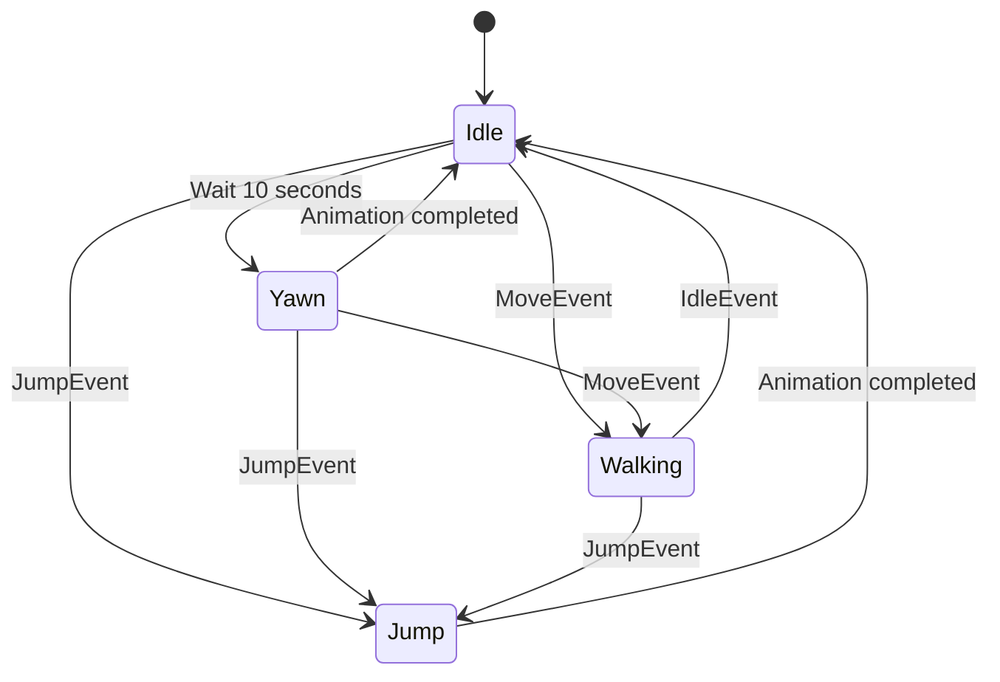

# Example FSM

Description of the Example Finite State Machine stored in the `Samples` folder
under the `ExampleFSM`

```text
Assets\Samples\ExampleFSM
```

This ExampleFSM is defined under the script
@nickmaltbie.StateMachineUnity.ExampleFSM.ExampleSMAnim
which implements the @nickmaltbie.StateMachineUnity.Fixed.FixedSMAnim
abstract class.

## State Machine Design

The design goal of this state machine is to provide the basic implementation
of a character controller with a few supported requirements.

1. Animations for player movement.
1. Moving and jumping actions.
1. Show off different transition types with yawn animation if player
  does nothing for some period of time.

To keep this example simple, I did not add actual movement and camera controls
as that code can get complex quickly and I wanted to keep this example as
simple as possible to show off how to use the
@nickmaltbie.StateMachineUnity.Fixed.FixedSMAnim

## State Machine Definition

Given this constraint, the state machine has only two inputs
of @nickmaltbie.StateMachineUnity.ExampleFSM.ExampleSMAnim.moveAction
and @nickmaltbie.StateMachineUnity.ExampleFSM.ExampleSMAnim.jumpAction

The moveAction is a @UnityEngine.Vector2 input and jumpAction is
just a button press action.

The design of the example state machine is as follows:

### States

* Idle: @nickmaltbie.StateMachineUnity.ExampleFSM.ExampleSMAnim.IdleState
* Jump: @nickmaltbie.StateMachineUnity.ExampleFSM.ExampleSMAnim.JumpState
* Yawn: @nickmaltbie.StateMachineUnity.ExampleFSM.ExampleSMAnim.YawnState
* Walking: @nickmaltbie.StateMachineUnity.ExampleFSM.ExampleSMAnim.WalkingState

### Events

* @nickmaltbie.StateMachineUnity.ExampleFSM.ExampleSMAnim.MoveEvent
  \- Event raised whenever the player hits a move input.
* @nickmaltbie.StateMachineUnity.ExampleFSM.ExampleSMAnim.IdleEvent
  \- Event raised whenever the player stops hitting the
  move input.
* @nickmaltbie.StateMachineUnity.ExampleFSM.ExampleSMAnim.JumpEvent
  \- Event raised whenever the player stops hitting the
  jump input.

### Transition Diagram


